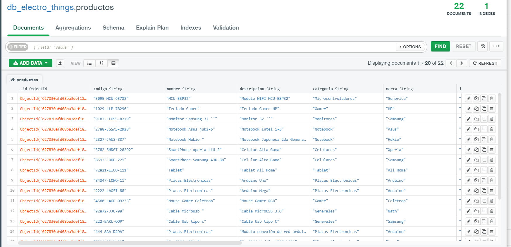

 

# db_ElectroThings_MongoDB
* Base de Datos acerca de componentes electrónicos de diversas categorías desarrollado con el SGDB NoSQL MongoDB.
* [Repositorio ApiRest_ElectroThingsV1](https://github.com/andresWeitzel/ApiRest_ElectroThingsV1_SpringBoot_MongoDB)
* [Repositorio AppTiendaElectronica](https://github.com/andresWeitzel/AppTiendaElectronica_Angular_Bootstrap_SpringBoot_MongoDB)

 

## Índice 📜

 
 Ver 

 
  
 
### Sección 1) Descripción, Ejecución y Tecnologías 

 - [1.0) Descripción del Proyecto.](#10-descripción-)
 - [1.1) Ejecución del Proyecto.](#11-ejecución-del-proyecto-)
 - [1.2) Tecnologías.](#12-tecnologías-)
 - [1.3) Descargas.](#13-descargas-)

  
### Sección 2) Prueba de Funcionalidad y Referencias
 
 - [2.0) Prueba de Funcionalidad.](#20-prueba-de-funcionalidad-)
 - [2.1) Referencias.](#21-referencias-)
	  

 

## Sección 1) Descripción, Ejecución y Tecnologías

### 1.0) Descripción [🔝](#índice-) 

 
Ver

 
  

* La db consta de Dos Colecciones, una de Productos Electrónicos y la otra acerca de Usuarios para la autenticación.
* Para la colección usuarios, en el campo password se aplica la función de cifrado bcript, el back trabajará con esta función junto con PasswordEncoder de Spring Security para la codificación de seguridad.
* Se aplica el modelado de bases de datos orientado a documentos(mongo) y los roles de cada usuario se almacena en arrays junto a la colección de usuarios, en comparación a la normalización de tablas de un sistema sql.
* Esta Arquitectura es completamente escalable según el propósito del proyecto que se lleve a cabo. El enfoque es la Modularización de Colecciones por archivos.
* Se generó un .json por cada Coleccion, además de la doc gráfica.
 
 

### 1.1) Ejecución del Proyecto [🔝](#índice-)

  
Ver

  
    
  
* Descargamos [MongoDB compass](https://www.mongodb.com/it-it/products/compass) para ejecutar los servicios de Mongodb.
* Abrimos una terminal y clonamos el [repo de base de datos](https://github.com/andresWeitzel/db_ElectroThings_MongoDB).
* Seguidamente procedemos a la creación de nuestros registros desde formato csv o json.

### Creación de Documentos/Base de Datos y Colección

* Podemos usar MongoSHELL, pero es poco eficiente y legible la inseción de datos por shell, usaremos Compass (https://www.mongodb.com/products/compass) como interfaz gráfica y editor
* Ademas vamos a crear nuestra db en formato csv para agilizar tiempo y repetición de campos. Agregamos 20 registros

#### Pasos MongoDB
* Creamos nuestra db
  * Database Name : db_electro_things
  * Collection Name : productos
* Agregamos registros desde archivo CSV
  * Seleccionamos nuestra db, seleccionamos la colección productos
  * ADD DATA
  * import file
  * select file
  * linkeas el doc csv desde el filesystem de este repo
  * import
  * Si aparecen los registros se ha importado correctamente
    
 

####  Colección ejemplar  `productos.csv`

* Agregamos registros desde archivo Json
  * En mi caso use un convertidor de documentos online, pase el archivo CSV a JSON. 

 

####  Colección ejemplar  `productos.json`

 

### 1.2) Tecnologías [🔝](#índice-)

 
Ver

 
  

| **Tecnologías Empleadas** | **Versión** | **Finalidad** |               
| ------------- | ------------- | ------------- |
| MongoDB | 5.0  | DB  |
| MongoDB Compass | 1.31.2  | Gestor de MongoDB | 
| Git Bash | 2.29.1  | Control de Versiones |
| CMD | 10 | Manipular los Servicios de Postgres mediante linea de comandos | 

 

### 1.3) Descargas [🔝](#índice-)

 
Ver

 
  

## Descarga y Documentacion de las Tecnologías Empleadas:

 

| **Tecnologías** | **Descarga** | **Documentación** |               
| ------------- | ------------- | ------------- |
| Git Bash |  https://git-scm.com/downloads |   https://git-scm.com/docs |
| MongoDB |  https://www.mongodb.com/try/download/community  | https://www.mongodb.com/try/download/community |
| MongoDB Compass | https://www.mongodb.com/try/download/compass  | https://www.mongodb.com/try/download/compass | 

  

 

## Sección 2) Prueba de Funcionalidad y Referencias

### 2.0) Prueba de Funcionalidad [🔝](#índice-)

 
Ver

  

#### Colecciones de la base de datos

#### Colección  `productos`

#### Colección  `usuarios`

  

### 2.1) Referencias [🔝](#índice-)

 
Ver

  

 

## Bibliografía Oficial y No Oficial Recomendada
* Doc oficial : https://www.mongodb.com/docs/manual/tutorial/getting-started/
* Convertidor de texto plano a texto cifrado(Bcrypt) : https://www.browserling.com/tools/bcrypt
* Convertidor CSV a Json : https://www.convertcsv.com/csv-to-json.htm

  

